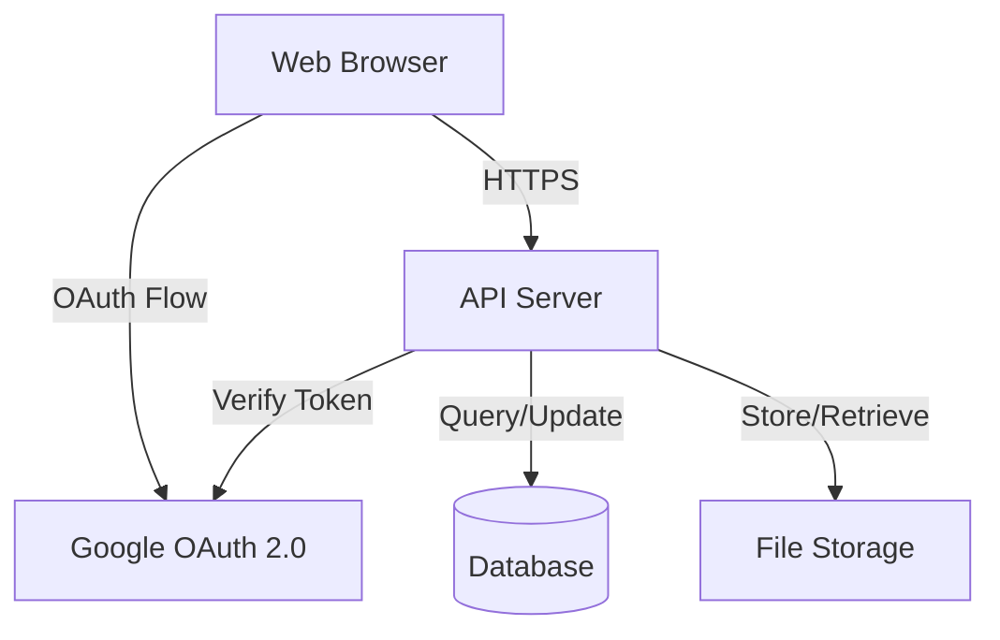
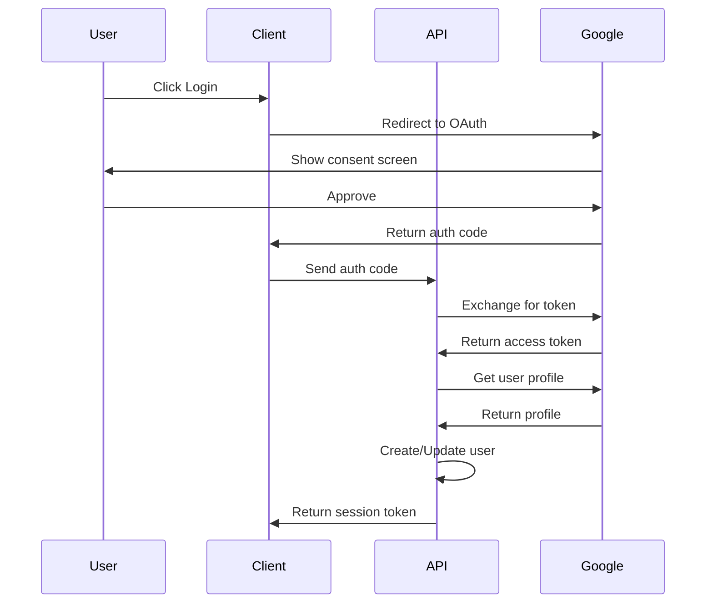
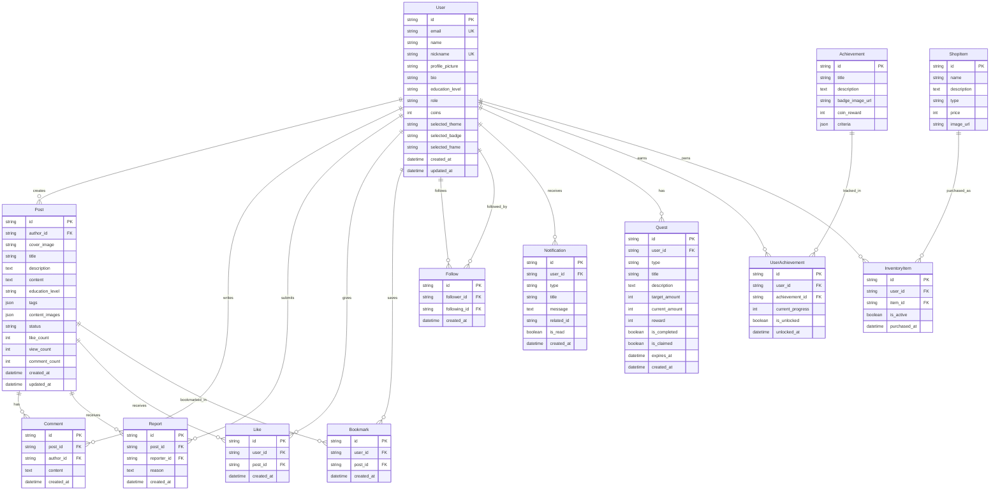

# Design Document: Knowledge Sharing Platform

## Overview

ระบบแพลตฟอร์มแชร์ความรู้เป็น web application ที่ออกแบบมาเพื่อให้ผู้ใช้งานสามารถแบ่งปันความรู้ผ่านการสร้างและเผยแพร่โพสต์ โดยมีระบบจัดการผู้ใช้งานหลายระดับ ระบบรางวัลและภารกิจ การค้นหาและกรองเนื้อหา รวมถึงระบบการแจ้งเตือนและการติดตามผู้ใช้งาน

ระบบนี้ใช้สถาปัตยกรรมแบบ Client-Server โดย:
- **Frontend**: Web application ที่รองรับ responsive design
- **Backend**: RESTful API server
- **Authentication**: Google OAuth 2.0
- **Database**: Relational database สำหรับจัดเก็บข้อมูล
- **File Storage**: ระบบจัดเก็บไฟล์สำหรับรูปภาพและเอกสาร

## Architecture

### System Architecture



### Component Architecture

ระบบแบ่งออกเป็น layers หลักดังนี้:

1. **Presentation Layer**: UI components และ client-side logic
2. **API Layer**: RESTful endpoints และ request handling
3. **Business Logic Layer**: Core business rules และ workflows
4. **Data Access Layer**: Database operations และ queries
5. **External Services Layer**: Google OAuth, File Storage

### Authentication Flow



## Components and Interfaces

### 1. Authentication Service

**Responsibilities:**
- จัดการ Google OAuth 2.0 flow
- สร้างและตรวจสอบ session tokens
- จัดการ user sessions

**Interfaces:**

```typescript
interface AuthService {
  // เริ่ม OAuth flow
  initiateLogin(): OAuthRedirectURL
  
  // แลกเปลี่ยน auth code เป็น access token
  exchangeAuthCode(code: string): Promise<AccessToken>
  
  // ดึงข้อมูล user profile จาก Google
  getUserProfile(accessToken: AccessToken): Promise<GoogleProfile>
  
  // สร้าง session token สำหรับระบบ
  createSession(userId: string): Promise<SessionToken>
  
  // ตรวจสอบ session token
  validateSession(token: SessionToken): Promise<User>
  
  // ออกจากระบบ
  logout(token: SessionToken): Promise<void>
}

interface GoogleProfile {
  id: string
  email: string
  name: string
  picture: string
}

interface SessionToken {
  token: string
  expiresAt: Date
}
```

### 2. User Service

**Responsibilities:**
- จัดการข้อมูลผู้ใช้งาน
- จัดการบทบาทและสิทธิ์
- จัดการโปรไฟล์

**Interfaces:**

```typescript
interface UserService {
  // สร้างหรืออัพเดทผู้ใช้งานจาก Google profile
  createOrUpdateUser(profile: GoogleProfile): Promise<User>
  
  // ดึงข้อมูลผู้ใช้งาน
  getUser(userId: string): Promise<User>
  
  // อัพเดทโปรไฟล์
  updateProfile(userId: string, updates: ProfileUpdate): Promise<User>
  
  // เปลี่ยนบทบาท (Admin only)
  changeRole(adminId: string, targetUserId: string, newRole: UserRole): Promise<User>
  
  // ตรวจสอบ nickname ซ้ำ
  isNicknameAvailable(nickname: string, excludeUserId?: string): Promise<boolean>
  
  // ดึงรายการผู้ติดตาม
  getFollowers(userId: string): Promise<User[]>
  
  // ดึงรายการที่กำลังติดตาม
  getFollowing(userId: string): Promise<User[]>
}

interface User {
  id: string
  email: string
  name: string
  nickname: string
  profilePicture: string
  bio: string
  educationLevel: EducationLevel
  role: UserRole
  coins: number
  createdAt: Date
  updatedAt: Date
}

enum UserRole {
  MEMBER = 'member',
  MODERATOR = 'moderator',
  ADMIN = 'admin'
}

enum EducationLevel {
  JUNIOR_HIGH = 'junior_high',      // ม.ต้น
  SENIOR_HIGH = 'senior_high',      // ม.ปลาย
  UNIVERSITY = 'university'          // มหาวิทยาลัย
}

interface ProfileUpdate {
  nickname?: string
  profilePicture?: string
  bio?: string
  educationLevel?: EducationLevel
  selectedTheme?: string
  selectedBadge?: string
  selectedFrame?: string
}
```

### 3. Post Service

**Responsibilities:**
- จัดการการสร้าง แก้ไข ลบโพสต์
- ตรวจสอบ rate limiting
- จัดการสถานะโพสต์

**Interfaces:**

```typescript
interface PostService {
  // สร้างโพสต์
  createPost(userId: string, postData: CreatePostData): Promise<Post>
  
  // ตรวจสอบ rate limit (3 posts per 24 hours)
  checkRateLimit(userId: string): Promise<boolean>
  
  // แก้ไขโพสต์
  updatePost(userId: string, postId: string, updates: PostUpdate): Promise<Post>
  
  // ลบโพสต์ (soft delete)
  deletePost(userId: string, postId: string): Promise<void>
  
  // ดึงโพสต์
  getPost(postId: string): Promise<Post>
  
  // ดึงโพสต์ทั้งหมดของผู้ใช้งาน
  getUserPosts(userId: string): Promise<Post[]>
  
  // เพิ่ม view count
  incrementViewCount(postId: string): Promise<void>
  
  // ดึงโพสต์ยอดนิยม
  getPopularPosts(limit: number): Promise<Post[]>
}

interface Post {
  id: string
  authorId: string
  coverImage: string
  title: string
  description: string
  content: string
  educationLevel: EducationLevel
  tags: string[]
  contentImages: string[]
  status: PostStatus
  likeCount: number
  viewCount: number
  commentCount: number
  createdAt: Date
  updatedAt: Date
}

enum PostStatus {
  ACTIVE = 'active',
  UNACTIVED = 'unactived',
  DELETED = 'deleted'
}

interface CreatePostData {
  coverImage: string
  title: string
  description: string
  content: string
  educationLevel: EducationLevel
  tags: string[]
  contentImages: string[]
}

interface PostUpdate {
  coverImage?: string
  title?: string
  description?: string
  content?: string
  educationLevel?: EducationLevel
  tags?: string[]
  contentImages?: string[]
}
```

### 4. Report Service

**Responsibilities:**
- จัดการการรายงานโพสต์
- ตรวจสอบและเปลี่ยนสถานะโพสต์อัตโนมัติ
- จัดการการตรวจสอบของ Moderator

**Interfaces:**

```typescript
interface ReportService {
  // รายงานโพสต์
  reportPost(userId: string, postId: string, reason: string): Promise<Report>
  
  // ตรวจสอบว่าผู้ใช้งานเคยรายงานโพสต์นี้แล้วหรือไม่
  hasUserReported(userId: string, postId: string): Promise<boolean>
  
  // นับจำนวนการรายงาน
  getReportCount(postId: string): Promise<number>
  
  // ดึงรายการโพสต์ที่ถูกรายงาน (สำหรับ Moderator)
  getReportedPosts(): Promise<PostWithReports[]>
  
  // Moderator ลบโพสต์
  moderatorDeletePost(moderatorId: string, postId: string): Promise<void>
  
  // Moderator คืนสถานะโพสต์
  moderatorRestorePost(moderatorId: string, postId: string): Promise<void>
}

interface Report {
  id: string
  postId: string
  reporterId: string
  reason: string
  createdAt: Date
}

interface PostWithReports {
  post: Post
  reports: Report[]
  reportCount: number
}
```

### 5. Interaction Service

**Responsibilities:**
- จัดการการกดไลค์
- จัดการคอมเมนต์
- จัดการบุ๊กมาร์ก

**Interfaces:**

```typescript
interface InteractionService {
  // กดไลค์โพสต์
  likePost(userId: string, postId: string): Promise<void>
  
  // ยกเลิกไลค์โพสต์
  unlikePost(userId: string, postId: string): Promise<void>
  
  // ตรวจสอบว่าผู้ใช้งานไลค์โพสต์นี้แล้วหรือไม่
  hasUserLiked(userId: string, postId: string): Promise<boolean>
  
  // สร้างคอมเมนต์
  createComment(userId: string, postId: string, content: string): Promise<Comment>
  
  // ดึงคอมเมนต์ของโพสต์
  getPostComments(postId: string): Promise<Comment[]>
  
  // เพิ่มบุ๊กมาร์ก
  addBookmark(userId: string, postId: string): Promise<void>
  
  // ลบบุ๊กมาร์ก
  removeBookmark(userId: string, postId: string): Promise<void>
  
  // ดึงรายการบุ๊กมาร์ก
  getUserBookmarks(userId: string): Promise<Post[]>
  
  // ตรวจสอบว่าผู้ใช้งานบุ๊กมาร์กโพสต์นี้แล้วหรือไม่
  hasUserBookmarked(userId: string, postId: string): Promise<boolean>
}

interface Comment {
  id: string
  postId: string
  authorId: string
  content: string
  createdAt: Date
}
```

### 6. Follow Service

**Responsibilities:**
- จัดการการติดตามผู้ใช้งาน
- ตรวจสอบสถานะการติดตาม

**Interfaces:**

```typescript
interface FollowService {
  // ติดตามผู้ใช้งาน
  followUser(followerId: string, followingId: string): Promise<void>
  
  // ยกเลิกการติดตาม
  unfollowUser(followerId: string, followingId: string): Promise<void>
  
  // ตรวจสอบว่าผู้ใช้งานติดตามแล้วหรือไม่
  isFollowing(followerId: string, followingId: string): Promise<boolean>
  
  // นับจำนวนผู้ติดตาม
  getFollowerCount(userId: string): Promise<number>
  
  // นับจำนวนที่กำลังติดตาม
  getFollowingCount(userId: string): Promise<number>
}
```

### 7. Search Service

**Responsibilities:**
- ค้นหาโพสต์
- กรองตามหมวดหมู่
- เรียงลำดับผลลัพธ์

**Interfaces:**

```typescript
interface SearchService {
  // ค้นหาโพสต์
  searchPosts(query: SearchQuery): Promise<SearchResult>
}

interface SearchQuery {
  keyword?: string
  educationLevel?: EducationLevel
  tags?: string[]
  sortBy?: SortOption
  page: number
  pageSize: number
}

enum SortOption {
  POPULARITY = 'popularity',    // เรียงตาม like count
  DATE = 'date',                // เรียงตามวันที่เผยแพร่
  VIEWS = 'views'               // เรียงตามจำนวนการเข้าชม
}

interface SearchResult {
  posts: Post[]
  totalCount: number
  page: number
  pageSize: number
}
```

### 8. Notification Service

**Responsibilities:**
- สร้างและส่งการแจ้งเตือน
- จัดการสถานะการอ่าน

**Interfaces:**

```typescript
interface NotificationService {
  // สร้างการแจ้งเตือน
  createNotification(notification: CreateNotificationData): Promise<Notification>
  
  // ดึงการแจ้งเตือนของผู้ใช้งาน
  getUserNotifications(userId: string, unreadOnly?: boolean): Promise<Notification[]>
  
  // ทำเครื่องหมายว่าอ่านแล้ว
  markAsRead(notificationId: string): Promise<void>
  
  // ทำเครื่องหมายทั้งหมดว่าอ่านแล้ว
  markAllAsRead(userId: string): Promise<void>
  
  // นับจำนวนการแจ้งเตือนที่ยังไม่ได้อ่าน
  getUnreadCount(userId: string): Promise<number>
}

interface Notification {
  id: string
  userId: string
  type: NotificationType
  title: string
  message: string
  relatedId?: string  // post ID, comment ID, etc.
  isRead: boolean
  createdAt: Date
}

enum NotificationType {
  POST_LIKED = 'post_liked',
  POST_COMMENTED = 'post_commented',
  POST_STATUS_CHANGED = 'post_status_changed',
  POST_REPORTED = 'post_reported',
  NEW_FOLLOWER_POST = 'new_follower_post',
  BOOKMARK_REMOVED = 'bookmark_removed',
  ACHIEVEMENT_UNLOCKED = 'achievement_unlocked'
}

interface CreateNotificationData {
  userId: string
  type: NotificationType
  title: string
  message: string
  relatedId?: string
}
```

### 9. Shop Service

**Responsibilities:**
- จัดการร้านค้าและไอเทม
- จัดการการซื้อขาย
- จัดการ inventory ของผู้ใช้งาน

**Interfaces:**

```typescript
interface ShopService {
  // ดึงรายการไอเทมทั้งหมด
  getAllItems(): Promise<ShopItem[]>
  
  // ซื้อไอเทม
  purchaseItem(userId: string, itemId: string): Promise<PurchaseResult>
  
  // ดึง inventory ของผู้ใช้งาน
  getUserInventory(userId: string): Promise<InventoryItem[]>
  
  // ตรวจสอบว่าผู้ใช้งานมีไอเทมนี้แล้วหรือไม่
  hasItem(userId: string, itemId: string): Promise<boolean>
  
  // เปิดใช้งานไอเทม
  activateItem(userId: string, itemId: string): Promise<void>
}

interface ShopItem {
  id: string
  name: string
  description: string
  type: ItemType
  price: number
  imageUrl: string
}

enum ItemType {
  THEME = 'theme',
  FRAME = 'frame',
  BADGE = 'badge'
}

interface InventoryItem {
  itemId: string
  item: ShopItem
  purchasedAt: Date
  isActive: boolean
}

interface PurchaseResult {
  success: boolean
  newCoinBalance: number
  error?: string
}
```

### 10. Quest Service

**Responsibilities:**
- จัดการภารกิจรายวัน
- ตรวจสอบความคืบหน้า
- จัดการการรับรางวัล

**Interfaces:**

```typescript
interface QuestService {
  // สร้างภารกิจรายวันสำหรับผู้ใช้งาน
  generateDailyQuests(userId: string): Promise<Quest[]>
  
  // ดึงภารกิจของผู้ใช้งาน
  getUserQuests(userId: string): Promise<Quest[]>
  
  // อัพเดทความคืบหน้าของภารกิจ
  updateQuestProgress(userId: string, questType: QuestType, amount: number): Promise<void>
  
  // รับรางวัลจากภารกิจ
  claimQuestReward(userId: string, questId: string): Promise<ClaimResult>
  
  // รีเซ็ตภารกิจรายวัน (ทำงานอัตโนมัติทุก 24 ชั่วโมง)
  resetDailyQuests(): Promise<void>
}

interface Quest {
  id: string
  userId: string
  type: QuestType
  title: string
  description: string
  targetAmount: number
  currentAmount: number
  reward: number
  isCompleted: boolean
  isClaimed: boolean
  expiresAt: Date
  createdAt: Date
}

enum QuestType {
  CREATE_POST = 'create_post',
  COMMENT_POST = 'comment_post',
  LIKE_POST = 'like_post'
}

interface ClaimResult {
  success: boolean
  coinsAwarded: number
  newCoinBalance: number
  error?: string
}
```

### 11. Achievement Service

**Responsibilities:**
- จัดการความสำเร็จ
- ตรวจสอบและปลดล็อกความสำเร็จอัตโนมัติ
- มอบรางวัล

**Interfaces:**

```typescript
interface AchievementService {
  // ดึงความสำเร็จทั้งหมด
  getAllAchievements(): Promise<Achievement[]>
  
  // ดึงความสำเร็จของผู้ใช้งาน
  getUserAchievements(userId: string): Promise<UserAchievement[]>
  
  // ตรวจสอบและปลดล็อกความสำเร็จ
  checkAndUnlockAchievements(userId: string): Promise<Achievement[]>
  
  // ปลดล็อกความสำเร็จเฉพาะ
  unlockAchievement(userId: string, achievementId: string): Promise<UnlockResult>
}

interface Achievement {
  id: string
  title: string
  description: string
  badgeImageUrl: string
  coinReward: number
  criteria: AchievementCriteria
}

interface AchievementCriteria {
  type: AchievementType
  targetValue: number
}

enum AchievementType {
  POSTS_CREATED = 'posts_created',
  POSTS_READ = 'posts_read',
  COMMENTS_MADE = 'comments_made',
  LIKES_GIVEN = 'likes_given',
  FOLLOWERS_GAINED = 'followers_gained'
}

interface UserAchievement {
  achievementId: string
  achievement: Achievement
  currentProgress: number
  isUnlocked: boolean
  unlockedAt?: Date
}

interface UnlockResult {
  success: boolean
  coinsAwarded: number
  newCoinBalance: number
  badge: string
}
```

### 12. File Service

**Responsibilities:**
- จัดการการอัพโหลดไฟล์
- ตรวจสอบประเภทไฟล์
- จัดเก็บและดึงไฟล์

**Interfaces:**

```typescript
interface FileService {
  // อัพโหลดไฟล์
  uploadFile(file: File, userId: string): Promise<FileUploadResult>
  
  // ตรวจสอบประเภทไฟล์
  validateFileType(file: File): boolean
  
  // ดึง URL ของไฟล์
  getFileUrl(fileId: string): string
  
  // ลบไฟล์
  deleteFile(fileId: string): Promise<void>
}

interface File {
  name: string
  type: string
  size: number
  data: Buffer | Blob
}

interface FileUploadResult {
  success: boolean
  fileId: string
  fileUrl: string
  error?: string
}
```

## Data Models

### Database Schema



### Key Constraints and Indexes

**Unique Constraints:**
- User.email (unique)
- User.nickname (unique)
- Like(user_id, post_id) (composite unique)
- Bookmark(user_id, post_id) (composite unique)
- Follow(follower_id, following_id) (composite unique)
- Report(reporter_id, post_id) (composite unique)
- InventoryItem(user_id, item_id) (composite unique)

**Indexes:**
- Post.author_id
- Post.status
- Post.education_level
- Post.created_at
- Post.like_count (for popular posts)
- Comment.post_id
- Report.post_id
- Notification.user_id, is_read
- Quest.user_id, expires_at
- UserAchievement.user_id

## Correctness Properties

*A property is a characteristic or behavior that should hold true across all valid executions of a system—essentially, a formal statement about what the system should do. Properties serve as the bridge between human-readable specifications and machine-verifiable correctness guarantees.*


### Property Reflection

หลังจากวิเคราะห์ acceptance criteria ทั้งหมด พบว่ามี properties ที่ซ้ำซ้อนหรือสามารถรวมกันได้:

**Properties ที่ซ้ำซ้อน:**
- 8.5 (follower notifications) ซ้ำกับ 9.3 → ใช้ property เดียว
- 8.1 (comment notifications) ซ้ำกับ 14.5 → ใช้ property เดียว
- 2.1 และ 2.2 (role changes) สามารถรวมเป็น property เดียวเกี่ยวกับ role updates

**Properties ที่สามารถรวมกันได้:**
- 5.4, 7.4 (exclude unactived posts) สามารถรวมเป็น property เดียวเกี่ยวกับ filtering
- 4.2, 9.4, 10.4 (prevent duplicates) ใช้ pattern เดียวกัน สามารถเป็น properties แยกกันแต่ใช้ logic เดียวกัน
- 14.1 และ 14.2 (like/unlike) เป็น inverse operations สามารถทดสอบเป็น round-trip property

**Properties ที่ควรเก็บไว้แยก:**
- Authentication และ authorization properties (1.x, 2.x, 17.x) เป็น critical security features
- Transaction และ data integrity properties (6.8, 19.x) เป็น critical correctness features
- Rate limiting properties (3.3, 17.5) เป็น important business rules

### Core Properties

**Property 1: User Authentication and Session Management**
*For any* valid Google profile, when the system creates or updates a user account, the user data SHALL be persisted correctly and retrievable by user ID
**Validates: Requirements 1.4**

**Property 2: Session Invalidation**
*For any* valid session token, after logout is performed, the session SHALL no longer be valid for authentication
**Validates: Requirements 1.6**

**Property 3: Role Assignment Authorization**
*For any* user role change request, the system SHALL only allow Admin users to perform the role assignment
**Validates: Requirements 2.4**

**Property 4: Role Update Immediate Effect**
*For any* user, when their role is updated, subsequent permission checks SHALL reflect the new role immediately
**Validates: Requirements 2.3**

**Property 5: Post Creation Required Fields**
*For any* post creation attempt missing required fields (cover image, title, description, education level, or content), the system SHALL reject the creation
**Validates: Requirements 3.1**

**Property 6: Post Creation Optional Fields**
*For any* post creation with empty tags or content images, the system SHALL accept the post successfully
**Validates: Requirements 3.2**

**Property 7: Post Rate Limiting**
*For any* user, when attempting to create a post, if the user has created 3 or more posts in the last 24 hours, the system SHALL reject the new post
**Validates: Requirements 3.3, 3.4**

**Property 8: Post Ownership Authorization**
*For any* post edit or delete operation, the system SHALL only allow the post owner to perform the operation
**Validates: Requirements 3.5, 3.7**

**Property 9: Soft Delete Preservation**
*For any* post that is soft deleted, the post SHALL remain in the database but SHALL NOT appear in public queries
**Validates: Requirements 3.6**

**Property 10: Report Duplicate Prevention**
*For any* user and post combination, the system SHALL only allow one report per user per post
**Validates: Requirements 4.2**

**Property 11: Automatic Post Deactivation**
*For any* post, when it receives exactly 10 unique reports, the system SHALL automatically change the status to unactived and hide it from public view
**Validates: Requirements 4.3**

**Property 12: Moderator Notification on Deactivation**
*For any* post that becomes unactived due to reports, the system SHALL send notifications to all users with Moderator role
**Validates: Requirements 4.4**

**Property 13: Reported Posts Visibility**
*For any* Moderator viewing reported posts, the system SHALL display all posts with unactived status or with at least one report
**Validates: Requirements 4.5**

**Property 14: Post Restoration**
*For any* unactived post, when a Moderator restores it, the post SHALL become active and visible in public queries
**Validates: Requirements 4.7**

**Property 15: Popular Posts Sorting**
*For any* set of active posts, when displayed in popular section, they SHALL be sorted by like count in descending order
**Validates: Requirements 5.1**

**Property 16: View Counter Increment**
*For any* post, each view operation SHALL increment the view counter by exactly 1
**Validates: Requirements 5.2**

**Property 17: Unactived Posts Exclusion**
*For any* public query (search, popular, listing), the results SHALL NOT include posts with unactived or deleted status
**Validates: Requirements 5.4, 7.4**

**Property 18: Sufficient Coins Validation**
*For any* item purchase attempt, if the user has insufficient coins, the system SHALL reject the purchase
**Validates: Requirements 6.2, 6.3**

**Property 19: Purchase Transaction Integrity**
*For any* successful item purchase, the system SHALL atomically deduct coins and add the item to inventory
**Validates: Requirements 6.4**

**Property 20: Duplicate Purchase Prevention**
*For any* item already in user's inventory, the system SHALL reject attempts to purchase it again
**Validates: Requirements 6.5**

**Property 21: Transaction Atomicity**
*For any* coin transaction, the system SHALL ensure atomic operations preventing duplicate deductions or partial updates
**Validates: Requirements 6.8**

**Property 22: Search by Title and Tags**
*For any* search query, the results SHALL include all active posts where the query matches the title or any tag
**Validates: Requirements 7.1**

**Property 23: Education Level Filtering**
*For any* education level filter, the results SHALL include only posts matching that specific education level
**Validates: Requirements 7.2**

**Property 24: Search Results Sorting**
*For any* search results with sort option (popularity, date, views), the results SHALL be ordered according to the selected criterion
**Validates: Requirements 7.3**

**Property 25: Comment Notification**
*For any* comment created on a post, the system SHALL send a notification to the post owner
**Validates: Requirements 8.1, 14.5**

**Property 26: Like Notification**
*For any* like action on a post, the system SHALL send a notification to the post owner
**Validates: Requirements 8.2**

**Property 27: Post Status Change Notification**
*For any* post status change, the system SHALL send a notification to the post owner
**Validates: Requirements 8.3**

**Property 28: Follower Post Notification**
*For any* new post created by a user, the system SHALL send notifications to all of that user's followers
**Validates: Requirements 8.5, 9.3**

**Property 29: Notification Persistence**
*For any* notification created, it SHALL be stored in the database and retrievable later
**Validates: Requirements 8.6**

**Property 30: Notification Read Status**
*For any* notification viewed by a user, the system SHALL mark it as read
**Validates: Requirements 8.7**

**Property 31: Follow Relationship Creation**
*For any* two users, when one follows the other, a follow relationship SHALL be created in the database
**Validates: Requirements 9.1**

**Property 32: Follow Relationship Removal**
*For any* existing follow relationship, when unfollowed, the relationship SHALL be removed from the database
**Validates: Requirements 9.2**

**Property 33: Duplicate Follow Prevention**
*For any* existing follow relationship, the system SHALL reject attempts to create the same relationship again
**Validates: Requirements 9.4**

**Property 34: Follower Count Accuracy**
*For any* user, the displayed follower and following counts SHALL match the actual number of relationships in the database
**Validates: Requirements 9.5**

**Property 35: Bookmark Addition**
*For any* user and post combination, when bookmarked, the post SHALL appear in the user's bookmark list
**Validates: Requirements 10.1**

**Property 36: Bookmark Removal with Notification**
*For any* bookmark removed, the post SHALL no longer appear in the bookmark list and a notification SHALL be sent
**Validates: Requirements 10.2**

**Property 37: Duplicate Bookmark Prevention**
*For any* existing bookmark, the system SHALL reject attempts to bookmark the same post again
**Validates: Requirements 10.4**

**Property 38: Bookmark Status Independence**
*For any* post regardless of status, users SHALL be able to bookmark it
**Validates: Requirements 10.5**

**Property 39: Quest Completion Marking**
*For any* quest, when the user completes the objective, the system SHALL mark the quest as completable
**Validates: Requirements 11.2**

**Property 40: Quest Reward Claim Validation**
*For any* quest reward claim, the system SHALL only allow claiming if the quest is completed
**Validates: Requirements 11.3, 11.4**

**Property 41: Quest Reward Distribution**
*For any* successful quest claim, the system SHALL add coins to the user account and mark the quest as claimed
**Validates: Requirements 11.5**

**Property 42: Quest Claim Idempotence**
*For any* already claimed quest, the system SHALL reject subsequent claim attempts
**Validates: Requirements 11.7**

**Property 43: Achievement Auto-Unlock**
*For any* user meeting achievement criteria, the system SHALL automatically unlock the achievement
**Validates: Requirements 12.1**

**Property 44: Achievement Reward Distribution**
*For any* unlocked achievement, the system SHALL immediately award coins and badge to the user
**Validates: Requirements 12.2, 12.4**

**Property 45: Achievement Unlock Notification**
*For any* unlocked achievement, the system SHALL send a notification to the user
**Validates: Requirements 12.3**

**Property 46: Achievement Progress Tracking**
*For any* user action contributing to achievements, the system SHALL update progress counters continuously
**Validates: Requirements 12.5**

**Property 47: Nickname Uniqueness**
*For any* nickname update, the system SHALL reject the update if the nickname is already taken by another user
**Validates: Requirements 13.1, 13.2**

**Property 48: Profile Picture Format Validation**
*For any* profile picture upload, the system SHALL only accept JPG or PNG formats
**Validates: Requirements 13.3**

**Property 49: Bio Length Validation**
*For any* bio update, the system SHALL reject updates exceeding 512 characters
**Validates: Requirements 13.4, 13.5**

**Property 50: Theme Inventory Validation**
*For any* theme selection, the system SHALL only allow themes that exist in the user's inventory
**Validates: Requirements 13.6**

**Property 51: Profile Update Persistence**
*For any* profile update, the changes SHALL be persisted to the database and immediately reflected in subsequent queries
**Validates: Requirements 13.7**

**Property 52: Education Level Validation**
*For any* education level update, the system SHALL only accept valid enum values (junior_high, senior_high, university)
**Validates: Requirements 13.8**

**Property 53: Like Counter Increment**
*For any* post, when a user likes it, the like count SHALL increment by exactly 1
**Validates: Requirements 14.1**

**Property 54: Like Toggle Behavior**
*For any* post, liking then unliking SHALL return the like count to its original value
**Validates: Requirements 14.2, 14.3**

**Property 55: Comment Data Integrity**
*For any* comment created, it SHALL be saved with correct timestamp, user information, and post association
**Validates: Requirements 14.4**

**Property 56: Comment Chronological Order**
*For any* post's comments, they SHALL be displayed in chronological order by creation timestamp
**Validates: Requirements 14.6**

**Property 57: File Format Validation**
*For any* file upload, the system SHALL only accept PDF, JPG, or PNG formats
**Validates: Requirements 15.1, 15.2**

**Property 58: File Storage and Reference**
*For any* valid file upload, the system SHALL store the file and return a retrievable reference
**Validates: Requirements 15.3**

**Property 59: File Association Integrity**
*For any* uploaded file, it SHALL be correctly associated with the corresponding post or profile
**Validates: Requirements 15.4**

**Property 60: Soft Delete File Preservation**
*For any* soft-deleted post, the associated file references SHALL be maintained for potential restoration
**Validates: Requirements 15.5**

**Property 61: Authentication Requirement**
*For any* protected endpoint, the system SHALL reject requests without valid authentication
**Validates: Requirements 17.1, 17.2**

**Property 62: Authorization Enforcement**
*For any* privileged operation, the system SHALL validate user permissions and reject unauthorized attempts with 403 status
**Validates: Requirements 17.3, 17.4**

**Property 63: Rate Limit Enforcement**
*For any* rate-limited operation, when limits are exceeded, the system SHALL reject requests with appropriate error messages
**Validates: Requirements 17.5, 17.6**

**Property 64: Transaction Rollback**
*For any* failed database transaction, the system SHALL rollback all changes to maintain consistency
**Validates: Requirements 19.1**

**Property 65: Operation Atomicity**
*For any* multi-step operation, the system SHALL ensure atomicity preventing partial updates
**Validates: Requirements 19.2**

**Property 66: Referential Integrity**
*For any* related data entities, the system SHALL maintain referential integrity constraints
**Validates: Requirements 19.3**

**Property 67: Secure Error Logging**
*For any* system error, the system SHALL log details without exposing sensitive information to users
**Validates: Requirements 19.4**

## Error Handling

### Error Categories

**1. Validation Errors (400 Bad Request)**
- Missing required fields
- Invalid data formats
- Length constraints violations
- Invalid enum values

**2. Authentication Errors (401 Unauthorized)**
- Missing authentication token
- Invalid or expired token
- Failed OAuth verification

**3. Authorization Errors (403 Forbidden)**
- Insufficient permissions for operation
- Attempting to modify others' resources
- Role-restricted operations

**4. Not Found Errors (404 Not Found)**
- Resource does not exist
- Deleted or unactived resources

**5. Conflict Errors (409 Conflict)**
- Duplicate entries (nickname, follow, bookmark)
- Concurrent modification conflicts

**6. Rate Limit Errors (429 Too Many Requests)**
- Post creation rate limit exceeded
- API rate limits exceeded

**7. Server Errors (500 Internal Server Error)**
- Database connection failures
- Unexpected system errors
- External service failures

### Error Response Format

```typescript
interface ErrorResponse {
  error: {
    code: string
    message: string
    details?: any
  }
}
```

### Error Handling Strategies

**Retry Logic:**
- Implement exponential backoff for transient failures
- Retry failed external service calls (Google OAuth, file storage)
- Maximum 3 retry attempts

**Transaction Management:**
- Use database transactions for multi-step operations
- Automatic rollback on any step failure
- Maintain data consistency

**Graceful Degradation:**
- Continue core functionality if non-critical services fail
- Cache frequently accessed data
- Queue notifications for later delivery if notification service fails

**Logging:**
- Log all errors with context (user ID, operation, timestamp)
- Separate logs for different severity levels
- Never log sensitive information (passwords, tokens)

## Testing Strategy

### Dual Testing Approach

ระบบนี้จะใช้การทดสอบแบบ dual approach ที่ผสมผสานระหว่าง:

**Unit Tests:**
- ทดสอบ specific examples และ edge cases
- ทดสอบ integration points ระหว่าง components
- ทดสอบ error conditions และ boundary cases
- ใช้สำหรับทดสอบ business logic ที่ซับซ้อน

**Property-Based Tests:**
- ทดสอบ universal properties ข้ามทุก inputs
- ใช้ randomization เพื่อ comprehensive coverage
- แต่ละ property test ต้องรันอย่างน้อย 100 iterations
- แต่ละ test ต้อง reference design property ด้วย comment tag

### Property-Based Testing Configuration

**Library Selection:**
- สำหรับ TypeScript/JavaScript: ใช้ `fast-check`
- สำหรับ Python: ใช้ `hypothesis`
- สำหรับ Java: ใช้ `jqwik`

**Test Configuration:**
```typescript
// ตัวอย่างสำหรับ TypeScript
import fc from 'fast-check';

// Feature: knowledge-sharing-platform, Property 1: User Authentication and Session Management
test('user creation persists data correctly', () => {
  fc.assert(
    fc.property(
      fc.record({
        id: fc.string(),
        email: fc.emailAddress(),
        name: fc.string(),
        picture: fc.webUrl()
      }),
      async (profile) => {
        const user = await userService.createOrUpdateUser(profile);
        const retrieved = await userService.getUser(user.id);
        expect(retrieved).toEqual(user);
      }
    ),
    { numRuns: 100 }
  );
});
```

**Tag Format:**
```
// Feature: {feature_name}, Property {number}: {property_text}
```

### Test Coverage Requirements

**Critical Paths (Must have 100% coverage):**
- Authentication and authorization
- Payment and coin transactions
- Data persistence and retrieval
- Rate limiting

**Important Paths (Should have >80% coverage):**
- Post creation and management
- User interactions (like, comment, bookmark)
- Notifications
- Search and filtering

**Nice-to-have Paths (Should have >60% coverage):**
- UI rendering logic
- Formatting and display
- Non-critical features

### Integration Testing

**External Services:**
- Mock Google OAuth for testing
- Mock file storage service
- Test error handling for service failures

**Database:**
- Use test database for integration tests
- Reset database state between tests
- Test transaction rollback scenarios

**API Endpoints:**
- Test all REST endpoints
- Verify request/response formats
- Test authentication and authorization
- Test error responses

### Performance Testing

**Load Testing:**
- Simulate concurrent users
- Test database query performance
- Identify bottlenecks

**Stress Testing:**
- Test system limits
- Verify graceful degradation
- Test recovery from failures

### Security Testing

**Authentication:**
- Test token validation
- Test session management
- Test logout functionality

**Authorization:**
- Test permission checks
- Test role-based access control
- Test resource ownership validation

**Input Validation:**
- Test SQL injection prevention
- Test XSS prevention
- Test file upload validation

### Test Automation

**Continuous Integration:**
- Run all tests on every commit
- Block merges if tests fail
- Generate coverage reports

**Test Organization:**
- Group tests by feature
- Separate unit, integration, and property tests
- Use descriptive test names

**Test Data:**
- Use factories for test data generation
- Use fixtures for common scenarios
- Clean up test data after tests
